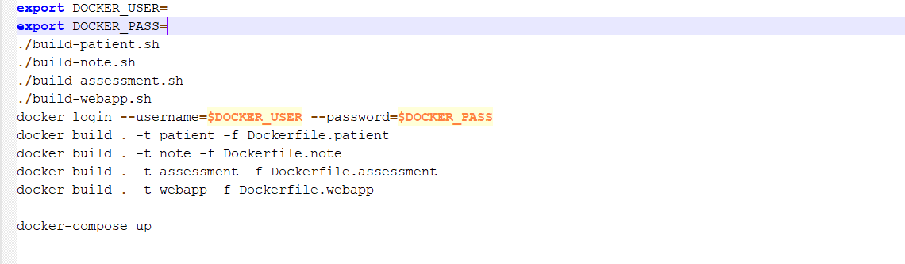
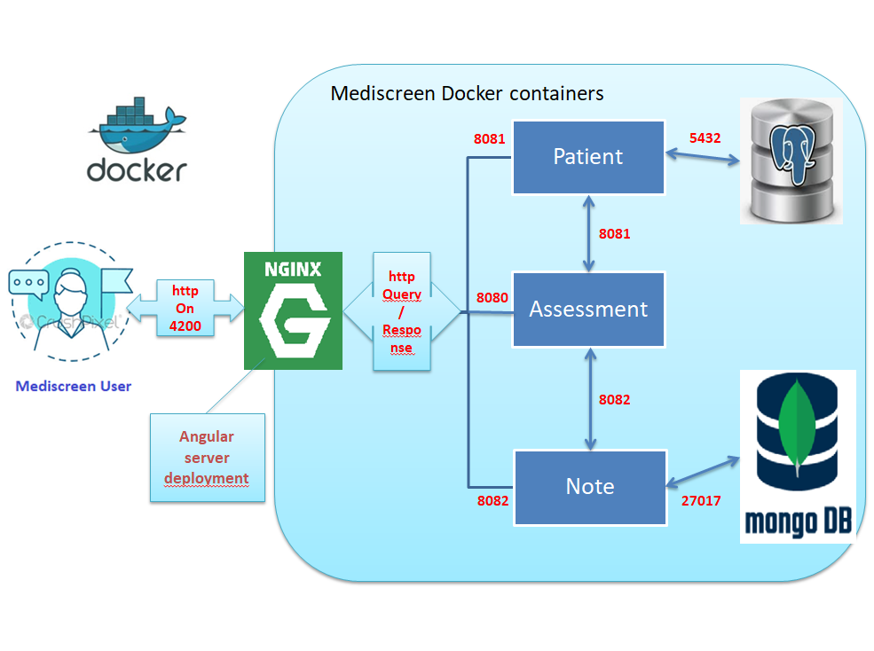

# Mediscreen
- Mediscreen is a Spring Boot application  specializes  for detecting risk factors for diseases.
## Getting Started
- These instructions will get you a copy of the project up and running on your local machine for development and testing purposes.
## Technologies
- Java 11 JDK
- Spring Boot 2.5.4
- Gradle 2.1.6
- Docker
- Angular 12
- MongoDB 3.5
- Postgres 10.5
- Liquibase 4.5.0
# Installing

1.Install Java:

https://docs.oracle.com/javase/8/docs/technotes/guides/install/install_overview.html

2.Install Gradle:

https://gradle.org/install/

3.Install Docker:

https://www.docker.com/products/docker-desktop

4. Install Angular:
- 1-Install Node Package Manager:

        npm install -g npm
- 2-Install Angular CLI:

        npm install -g @angular/cli
5. MongoDB:

- For information the image mongo:3.5 that I used in this project  is automatically installed by Docker.

6. Postgres:

    - For information Postgres that I used in this project is automatically installed by Docker.

# Running App
Requirements:
- Before proceeding in running the app you should first add your name and password in the docker-scripts.sh file
- In order to run the dockerized application you need to tab the command below that
  gathers the 4 scripts that build,connect to DockerHub and deploy each one of the 4 microservices applications in one file (presented below) :

      ./docker-scripts.sh

# Mediscreen frontend Url

http://localhost:4200/patients

# Mediscreen Architectural Overview

        